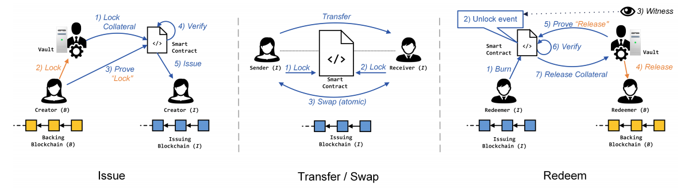
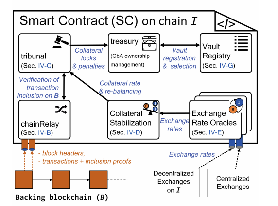

# Tokenbridge Helium to Ethereum
A **tokenbridge** between the [Helium blockchain](https://www.helium.com) - commonly referred to as the *native* network - and the [Ethereum blockchain](https://ethereum.org) - commonly referred to as the *foreign* network.

## 1. Blockchain Bridges - Background
A cornerstone technology of blockchain interoperability is the **blockchain bridge**. Blockchain bridges are ways for two economically sovereign and technologically diverse chains to communicate with each other. Blockchain bridges come in a variety of forms, from centralised and trusted to more decentralised and trustless. We definitely prefer the latter forms of bridges for our ecosystem, but there is nothing to stop a development team from building and deploying the former.

### 1.1 Bridging Methods
> Most of the information in this section is based on inputs from [Polkadot's wiki](https://wiki.polkadot.network/docs/learn-bridges). We strongly recommend anyone who wants to dive deeper to read the wiki carefully.

Building a bridge that is as decentralised and trustless as possible can be done through any of the following methods (ordered by suggested methodology):
- **Bridge pallets:** For Substrate-native chains, use a bridge pallet (e.g. `Kusama \<\> Polkadot` bridge, since both networks' parachains use Substrate).
    > Very simply put, [Substrate](https://www.substrate.io) is a software library that can help any developer build his/her own custom blockchain. Substrate is created by [Parity Technologies](https://www.parity.io) and provides the basis for [Polkadot](https://polkadot.network). For any further details, we recommend reading the article: [Substrate in a nutshell](https://www.parity.io/blog/substrate-in-a-nutshell).

- **Smart contracts:** If the chain is not on Substrate, we should have smart contracts on the non-Substrate chain to bridge (e.g. the Ethereum mainnet will have a bridge smart contract that initiates ether (ETH) transactions based on incoming [XCMP](https://wiki.polkadot.network/docs/learn-crosschain) messages).
- **Higher-order protocols:** If the chain does not support smart contracts (e.g. Bitcoin), we should use [XCLAIM](https://www.xclaim.io) (pronounced *cross-claim*) or similar protocols to bridge.

### 1.2 Examples
#### Ethereum Bridge (`Smart Contracts \<\> Polkadot`)
As explained by Dr. Gavin Wood in a high-level [blog post](https://medium.com/polkadot-network/polkadot-substrate-and-ethereum-f0bf1ccbfd13) from October 2019, there are three ways that e.g. the Polkadot and Substrate ecosystem can be bridged to the Ethereum ecosystem:
1. Polkadot <-> Ethereum public bridge;
2. Substrate <-> Parity-Ethereum-PoA bridge;
3. The Substrate EVM module;

#### Bitcoin Bridge (`XCLAIM \<\> Substrate \<\> Polkadot`)
The [Interlay](https://interlay.io) team has written a [specification](https://interlay.gitlab.io/interbtc-spec) on a Bitcoin bridge that is based on the [XCLAIM](https://eprint.iacr.org/2018/643.pdf) design paper. The protocol enables a two-way bridge between Polkadot and Bitcoin. It allows holders of BTC to *teleport* their assets to Polkadot as *PolkaBTC*, and holders of *PolkaBTC* to burn their assets for BTC on the Bitcoin chain.

The Bitcoin bridge as documented in the specification is composed of two logically different components:
- The [XCLAIM component](https://github.com/interlay/interbtc-spec/tree/master/interbtc-spec) that maintains all accounts that own PolkaBTC.
- The [BTC-Relay](https://github.com/interlay/interbtc-spec/tree/master/btcrelay-spec) that is responsible for verifying Bitcoin state when a new transaction is submitted.

There is now a [reference implementation and testnet available](https://bridge.interlay.io).

## 2. Bridging Helium to Ethereum - Proposed Path
Helium in its current state, as well as Ethereum, is not a Substrate-native chain, so we cannot use *bridge palettes*. Furthermore, the Helium blockchain does not support any smart contract functionality nor is it based on the Ethereum Virtual Machine (EVM). Also, unfortunately, a Turing-complete smart contract functionality is not part of the [Helium Improvement Proposals](https://github.com/helium/HIP). Whilst the implementation of such a feature is challenging, we strongly recommend submitting a proposal for this functionality as it will be an important feature for the management of IoT devices (e.g. part ownership, partial payments). Remember, a normal multi-signature wallet is already a smart contract. Due to these facts, we cannot use approaches like [TokenBridge](https://docs.tokenbridge.net) that allow users to transfer data (e.g. digital asset ownership information) between two chains in the Ethereum ecosystem. Generally, EVM-based cross-chain bridges provide fast and secure connections between blockchains and create scalability and connectivity - interoperability - between Ethereum networks.

Therefore, we are left with deploying a higher-order protocol to implement a decentralised bridge system. Since Interlay has successfully showcased the [XCLAIM](https://www.xclaim.io) protocol for the `Bitcoin \<\> Polkadot` bridge, we recommend building the `Helium \<\> Ethereum` on the same foundation. The overarching aim is to build a `HNT \<\> ERC20 Wrapped HNT (wHNT)` solution. By deploying `wHNT` on Ethereum, it will be possible to trade the token more easily via automated market makers such as [Uniswap](https://uniswap.org) and thus significantly increase asset liquidity. Assets that have a liquidity premium are up to 25% more valuable, making it even more attractive to become a miner on Helium.

### 2.1 Design Principles
> **Caveat 1:** XCLAIM operates between a backing blockchain *B* (e.g. Helium) of cryptocurrency *b* (e.g. HNT) and an issuing blockchain *I* (e.g. Ethereum) with underlying cryptocurrency-backed asset *i(b)*. Generally, XCLAIM establishes communication between two independent blockchains with likely varying consensus mechanisms and trust models. Therefore, should either blockchain *B* or *I* be compromised by an adversary, the correct functionality of XCLAIM cannot be guaranteed. As such, we assume that the proportion of consensus participants *f* (or computational power *α* in the case of Nakamoto consensus) corrupted by an adversary for both *B* and *I* is bounded by the threshold necessary to ensure safety and liveness for the underlying blockchains. For example, in Nakamoto consensus based blockchains, e.g. Bitcoin and Ethereum, we assume *α ≤ 33%*. In Byzantine fault tolerant settings using e.g. Proof-of-Stake, we assume *f < n/3* where *n* is the total number of consensus participants. As indicated [here](https://docs.helium.com/blockchain/consensus-protocol), the Helium consensus protocol should be tolerant to Byzantine failures.

> **Caveat 2:** We assume that the cryptographic primitives of *B* and *I* are secure.

XCLAIM guarantees that *i(b)*-backed tokens can be redeemed for the corresponding amount of *b*, or the equivalent economic value in *i*. Thereby, XCLAIM overcomes the limitations of centralised approaches through four primary techniques:
- **Secure audit logs:** Logs are constructed to record actions of all users both on *B* and *I*.
- **Transaction inclusion proofs:** Chain relays are used to prove the correct behavior on *B* to the smart contract on *I*.
- **Proof-or-punishment:** Instead of relying on timely fraud proofs (reactive), XCLAIM requires correct behavior to be proven *proactively*.
- **Overcollateralisation:** Non-trusted intermediaries are bound by collateral, with mechanisms in place to mitigate exchange rate fluctuations.

### 2.2 High-Level Overview
The XCLAIM solution is compliant with the [ERC20 token standard](https://eips.ethereum.org/EIPS/eip-20). An overview of the protocol is presented below ([source](https://eprint.iacr.org/2018/643.pdf)):

  

All parties interact with the smart contract, creating a publicly verifiable audit log. Correct behavior is enforced by (i) overcollateralising the *vault* and (ii) cross-chain transaction inclusion proofs. When issuing, the *requester* proves correctness of the lock making *Issue non-interactive*. Safety is ensured by forcing the *vault* to *proactively* prove correctness of the *Redeem* process. As a result, XCLAIM enforces *Transfer* and *Swap* occur consistently on the backing *B* and issuing *I* blockchains.

### 2.3 Issuing Smart Contract
A public smart contract is responsible for managing the correct issuance and exchange of *i(b)* on *I*. The issuing smart contract ensures correct behaviour of the *vault*. In the following a high-level overview of the architecture of the XCLAIM smart contract and the interactions between its components is presented. The references to the original [XCLAIM design paper sections](https://eprint.iacr.org/2018/643.pdf) introducing each component are also provided. The treasury refers to the basic ledger functionality of *I*.

  

## 3. License
The [`tokenbridge-helium-ethereum`](https://github.com/pcaversaccio/tokenbridge-helium-ethereum) implementation is licensed under the [GNU General Public License v3.0](https://www.gnu.org/licenses/gpl-3.0.en.html), also included in our repository in the [`LICENSE`](https://github.com/pcaversaccio/tokenbridge-helium-ethereum/blob/main/LICENSE) file.

## 4. References
[1] https://wiki.polkadot.network/docs/learn-bridges

[2] https://github.com/interlay/interbtc-spec

[3] https://docs.interlay.io

[4] https://eprint.iacr.org/2018/643.pdf
